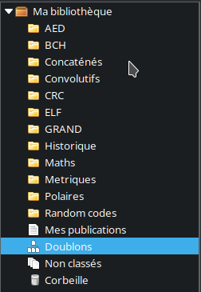
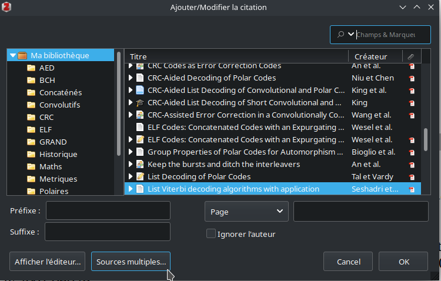
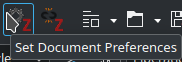
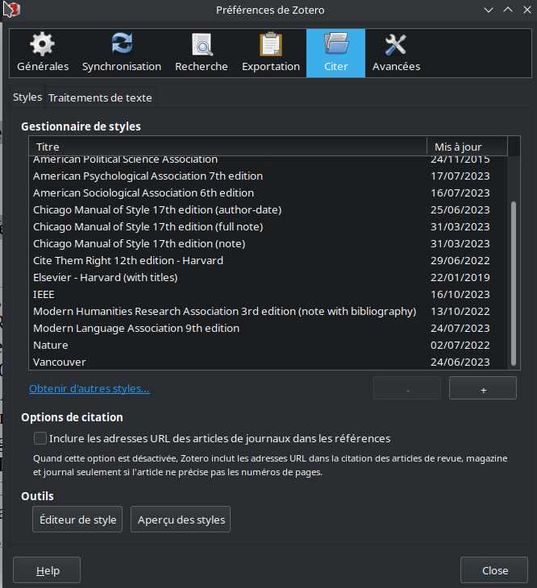
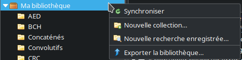
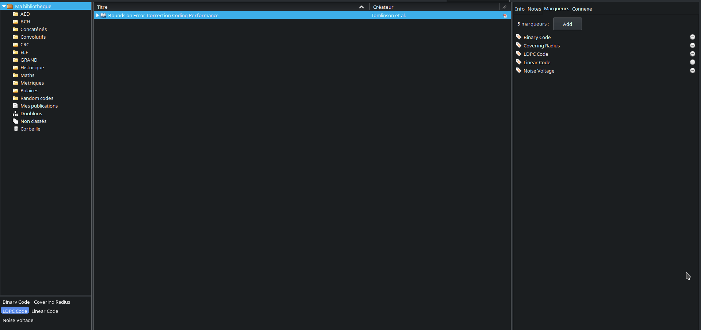

## Formation Zotero

**Formateur :** Jean-Yves Galipienso (jean-yves.galipienso@u-bordeaux.fr)

## Recherche WEB

### Récupérer un fichier

**Sur la page de l'article/thèse/etc**

Cliquer sur l'icône de Zotero . Sauvegarde automatique dans la bibliothèque

### Récupérer plusieurs fichiers

**Sur une page de moteur de recherche.** (Ex : Google Scholar)

Cliquer sur l'icône de Zotero , choisir les articles à sauvegarder.

### Associer un fichier à une référence

Glisser-déposer un fichier local directement sur la référence dans Zotero.

*Note* : L'association crée une copie locale indépendante du fichier local initial.

### Donner un nom cohérent au fichier

*Clic droit > Renommer le fichier à partir des métadonnées du parent*

*Exemple*

*Devient*

### Formats de biblio

RIS --> Zotero peut lire
BibTex --> Pour LaTeX (mais nan ?!)

### Notes dans Zotero

Notes personnelles et/ou notes automatiques. 

*Clic droit > Ajouter une note*

### Récupération depuis un DOI/ISBN/autres

Bouton "baguette magique"

/!\ Les ISBN *peuvent* être erronés. Les DOI sont plus fiables.

### Gestion des doublons (*oups*)

Bouton **doublons**

La fusion est possible si les deux fichiers sont similaires.

La fusion n'est pas possible si Zotero n'arrive pas à résoudre les différences entre les deux entrées.

### Configuration de l'affichage

Il est possible d'afficher davantage d'informations sur Zotero en faisant un clic droit et en sélectionnant les informations à afficher.

### Afficher ses publications

Catégorie *My Publications*

## Traitement de texte

*Support : **Libre Office***

### Prérequis

Vérifier que les icônes de Zotero soient présents (**EXTENSION À INSTALLER**).

### Citation simple

*Clic gauche sur le 1er icône (Add/Edit citation), taper des mots clés, trouver l'article*

### Vue classique

*Clic gauche sur le 1er icône (Add/Edit citation) > Clic gauche sur le Z > Vue classique*

### Citations multiples

Dans la vue classique > *Sources multiples* > Sélectionner les sources.

### Ajouter la bibliographie

*Clic gauche sur le 3e icône (Add/Edit bibliography)*

*Note :* La bibliographie se met à jour **automatiquement.**

### Ajouter une note

*2e icône (Add Note)*

Trouver la note avec les mots clés.

La note est importée comme du texte simple.

### Changer le style de bibliographie

*Clic gauche sur le 5e icône (Document Preferences)* > Self-explanatory.

Le style à utiliser et l'emplacement des citations dépend du type de document (article, manuscrit, nombre de pages...), et de l'éditeur (en cas d'article par exemple).

Pour un article, elles seront généralement à la fin de la dernière page.

Pour un manuscrit, elles seront généralement en fin de chapitre, par chapitre.

On peut aussi retrouver des citations en bas de page, dans certains cas.

### Ajouter des styles

*Cinquième icône* (Document Preferences)

Appuyer sur *Gérer les styles...*

**Si on dispose du fichier de style localement**, appuyer sur *+*

**Sinon,** appuyer sur *Obtenir d'autres styles...* et trouver le style dans le *repository.*

### Retirer les codes de champ Zotero

*Sixième icône (unlink citations).*

/!\ Transforme toute la biblio en texte simple. Empêche Zotero d'appliquer **toute** modification sur la biblio.

Il est **fortement recommandé** de faire une copie du document de travail **avant** d'unlink.

## Classifier sa bibliographie

### Notion de collection

Zotero permet de séparer sa bibliographie en collections.

*Clic droit* pour créer une nouvelle collection.

/!\ Une collection **n'est pas** un dossier. Une même référence peut faire partie de plusieurs collections.

Lors de l'ajout d'un fichier depuis le web, il est possible de spécifier une collection dans laquelle l'enregistrer.

Les références de la bibliothèque peuvent être ajoutées à une collection par glisser-déposer.

Enfin, la bibliothèque regroupe tous les articles de **toutes** les collections.

*Note :* Une même référence mise dans deux collections **n'est pas** dupliquée. C'est la **même** référence dans les deux collections, et toute modification de la référence depuis une collection A sera visible depuis la collection B.

Il est à noter que l'on peut aussi créer des collections dans une collection, ou des collections dans une collection, dans une collection, dans une...

### Trouver toutes les collections dont une référence fait partie

*Clic gauche sur la référence > Contrôle (maintenir enfoncé).*

### Système de tags

Zotero permet aussi d'apposer des tags (*marqueurs*) sur les références. Parfois, les tag sont déjà mis par la base de données, parfois il faut les mettre soi même.

On peut ensuite les utiliser pour filtrer les références.

Les tags automatiques se distinguent des tags manuels par la couleur de leur icône.

On peut aussi mettre un tag en couleur pour le retrouver plus facilement, et/ou l'associer à une touche du clavier.

Le raccourci clavier permet d'ajouter rapidement un tag à une référence.

***Rule of thumb*** : Quand utiliser des collections et/ou des marqueurs ?

- Jusqu'à 50 références : Pas besoin de collections.
- De 50 à 300 références : Organisation par collections
- à partir de 300 références : Organisation par références + marqueurs

### Références connexes

Permet de relier ensemble deux (ou plus) références.

La connexité peut être thématique, liée à un même auteur, une citation, ou juste si on a besoin de passer rapidement d'un article à un autre.

On peut aussi utiliser des bases de données en ligne comme `Scopus` pour récupérer les articles reliés entre eux.

Il suffit pour cela de toutes les importer dans une collection séparée, puis d'ajouter **tout** le contenu de la collection comme connexe (`ctrl + A`).

## Stockage de bibliographies

### Sauvegarde sur le cloud

Si on possède un compte Zotero, il est possible de sauvegarder automatiquement sa bibliographie sur leur cloud (depuis le site de [zotero](https://www.zotero.org)).

Il est possible de choisir de synchroniser uniquement les références ; les références + les notes, ou les références, les notes et les pdf. (**attention**, les pdf risquent d'être lourds).

Pour éviter que les pdf soient synchronisés, aller dans *Édition > Préférences > Synchronisation* et désactiver la synchronisation des fichiers attachés.

La limite de données synchronisables sur le cloud est de `300 Mo`.

Il est aussi possible d'accéder aux références synchronisées depuis le site web de [zotero](https://www.zotero.org).

### Travailler en mode collaboratif

Toujours à partir d'un compte sur le site de [zotero](https://www.zotero.org), il est possible de créer un groupe public ou privé (*Private Membership*), pour partager des références avec d'autres utilisateurs, ou travailler conjointement sur une même bibliothèque.

### Fichiers RIS

Fichiers téléchargeables sur Internet et/ou exportables depuis Zotero.

*Fichiers > Exporter la bibliographie*

Et de même, une bibliographie peut être importée via un fichier RIS via *Fichier > Importer...*

## Annoter

### Convertir une annotation en note

On peut convertir une annotation de pdf en note, via le bouton *Ajouter une note depuis les annotations.*

Ces notes peuvent être importées dans l'outil de traitement de texte.

## Ateliers supplémentaires

Site de la BU sur Google (BU Bordeaux) --> Se former --> Rejoindre un atelier.
